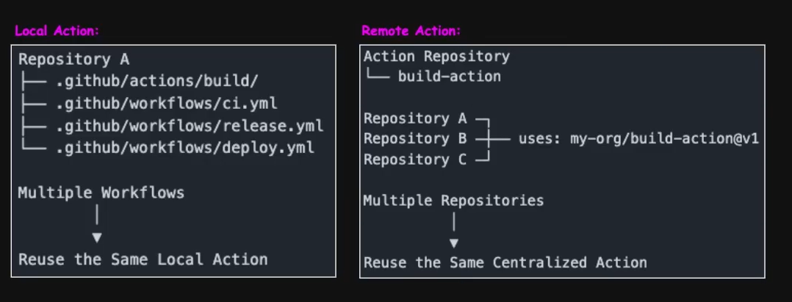

## GitHub Custom Actions Explained | Composite Actions with 2 Demos

### What are Github Custom Actions?

Github Custom Actions package reusable workflow logic into a single reusable component that can be used/invoked across one or more workflows.

- Encapsulates workflow steps. shell commands.scripts, or existing github Actions.
- Referenced inside workflows using the uses keyword.
- Eliminate duplication, improve reusability, and simplify workflow maintenance with a single reusable Action.

## Types of Github Custom Actions

### Composite Action

- Combines Github Actions, Shell/Bash scripts, or both
- Packages reusable CI/CD workflow Logic
- Supports inputs, outputs, and github Context
- Most widely used by devops engineers.
- Can be local (Same repository) or remote (dedicated repository)

- _JavaScript Action_
- Docker Action
