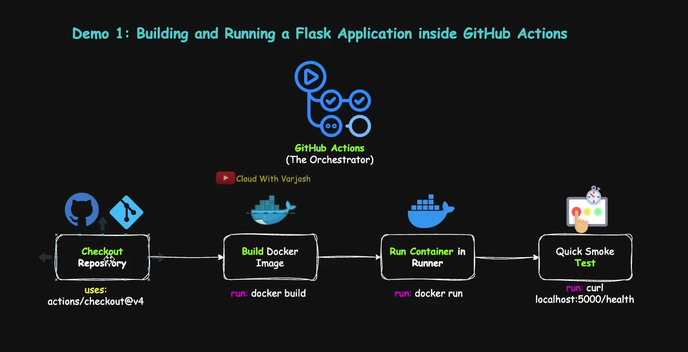

# Build Your First Production Style Workflow With Github Actions

## What are Actions in Github Actions?

Github Actions uses reusable automation components called actions to simplify CI/CD and Workflow automation

- Actions execute predefined automation tasks inside workflows
- Consumed using the uses: Keyword inside workflow steps
- Replace repetitive scripting with reusable automation logic
- Engineers must configure action inputs and parameters correctly for their use-case.
- Large Github Marketplace ecosystem of reusable actions.

## uses: vs run:

- _uses:_ for standardized reusable automation
- _run:_ for organization-specific custom logic and scripting
- Modern production workflows commonly use both together.

-> Note: _github action_ is the overall automation and CI/CD platform provided by github. _github actions_ uses reusable automation components called actions to simplify CI/CD and workflow automation.

---

## Sources of Actions

1. **Official Github Actions**
   - Officially maintained and published by Github
   - Commonly used for core workflows automation tasks
   - Example: actions/checkout, setup-java, cache

2. **Third-Party and Vendor Actions**
   - Published by vendors, communities, and external maintainers.
   - Commonly used for cloud, Docker, and Infrastructure workflows
   - Examples: Docker, AWS, Azure, Terraform actions

3. **Organization-Specific Internal Actions**
   - Custom reusable actions developed internally by organizations
   - Standardize CI/CD and automation across repositories
   - Example: deployment, compliance, security scanning actions

- **Choosing Actions for Productions Workflows**
  - Prefer verifies creators and well-known vendors
  - Prefer widely used, highly starred, and actively maintained actions.
  - Review documentation, release history, and issue activity
  - Inspect source code and required permissions whenever possible

-> We will get a new Runner every Time we run a different Job

## Demo 1: Building and Running a Flask Application inside Github Actions

