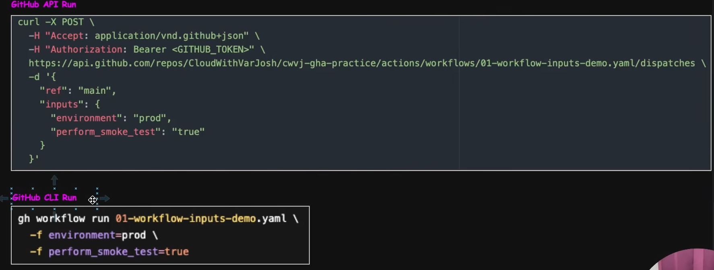

# GitHub Actions Inputs Explained | Workflow Inputs, Reusable Workflows & Production Use Cases

## Inputs

Inputs are parameters used to pass user-defined values into workflows, reusable workflows, or actions at runtime.

**Workflow Inputs**

- Used to provide values when triggering workflows using _workflow_dispatch_
- Example: Providing deployment parameters such as env, app version, or deployment strategy at runtime.

_Example_

```bash
name: 01 - Input Workflows
on:
  workflow_dispatch:
    inputs:
      environment:
        description: Deployment Environment
        required: true
        type: choice
        default: dev
        options:
          - dev
          - qa
          - prod
jobs:
  deploy-2:
    steps:
      - name: Printing Variable
        run: |
          echo "Deploying to ${{ inputs.environment }}"
```

---

**Reusable Workflow Inputs**

- Used to pass values from a calling workflow to a reusable workflow using workflow_call.
- _Example_ : Passing application name, replica count, or security to a centralized deployment workflow.

_Example_

```bash
#  Reusable Workflows

name: 01 - Input Workflows
on:
  workflow_dispatch:
    inputs:
      application_name:
        description: What will be the Application Name
        required: true
        type: string
      run_security_scan:
        description: Do you want to run Security Scan
        required: true
        type: boolean
      replicas:
        description: How many replica You want
        required: true
        type: number

# Calling Workflow

jobs:
  deploy:
    uses: ./.github/workflows/deploy.yaml
    with:
      application_name: payment-service
      run_security_scan: true
      replicas: 2
```

---

**Action Inputs**

- Used to pass values from a workflow to a custom action during execution.
- _Example:_ Providing an image name, Slack channel, or Terraform workspace to control action behavior.

Example: Github API Run and Github CLI Run



---

**Input Type In Github Actions**

- _string_
  - Free-from text input
- _choice_
  - Select from predefined values
- _boolean_
  - true/false selection
- _number_
  - numeric value
- _environment_
  - Select a Github Environment

---

## Reusable Actions

_Example_

```bash
# ----------------------------------------------
# ./.github/workflows/deploy.yaml
# ----------------------------------------------

name: 01 - Reusable Deployment Workflow

on:
  workflow_call:
    inputs:
      application_name:
        required: true
        type: string
      run_security_scan:
        required: true
        type: string
      replicas:
        required: true
        type: string
jobs:
  deploy-application-job:
    runs-on: ubuntu-latest

    steps:
      - name: Display Deployment Parameters
        run: |
          echo "Application: ${{inputs.application_name}}"
          echo "Run Security Scan: ${{inputs.run_security_scan}}"
          echo "Replicas: ${{inputs.replicas}}"

      - name: Security Validation
        if: ${{inputs.run_security_scan}}
        run: |
          echo "Running Security Scan ..."
          echo "No critical vulnerabilities found ..."

      - name: Deploy Application
        run: |
          echo "Deploying ${{inputs.application_name}}"
          echo "Desired Replicas: ${{inputs.replicas}}"

      - name: Deployment Complete
        run: |
          echo "Deployment Completed successfully"

# ----------------------------------------------
# ./.github/workflows/payment-svc-deploy.yaml
# ----------------------------------------------

name: 02 - Payment Service Deployment Calling

on:
  workflow_dispatch:
  push:

jobs:
  run-unit-tests-job:
    runs-on: ubuntu-latest
    steps:
      - name: Execute Unit Tests
        run: |
          echo "Running Payment service unit tests ..."
          echo "All tests passed"

  build-payment-artifacts-job:
    runs-on: ubuntu-latest
    needs:
      - run-unit-tests-job
    steps:
      - name: Build Payment Artifacts
        run: |
          echo "Building Payment service artifacts..."
          echo "Artifacts generated successfully"

  deploy-payment-service-job:
    needs:
      - run-unit-tests-job
      - build-payment-artifacts-job

    uses: ./.github/workflows/deploy.yaml

    with:
      application_name: payment-service
      run_security_scan: true
      replicas: 5

```

and
